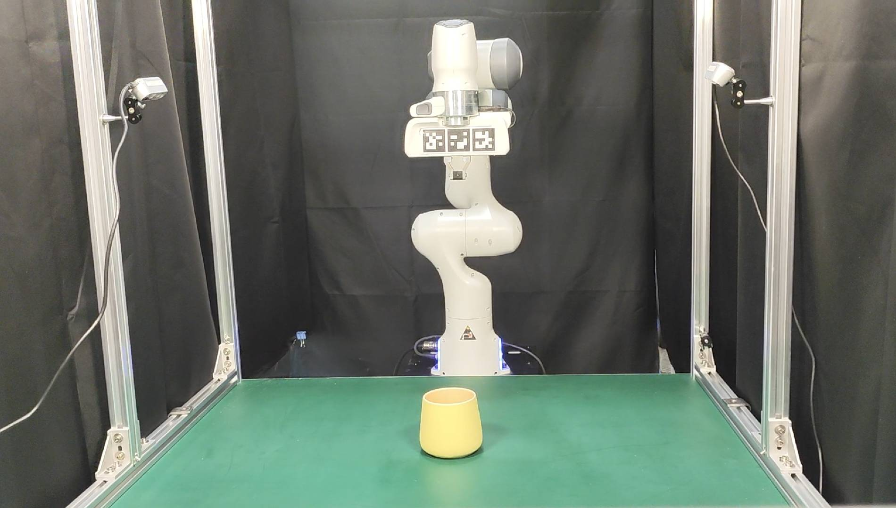

# Real-World Deployment Instruction

## Hardware Setup
- Franka Emika Panda robot with parallel jaw gripper.
- Two Intel RealSense D435 RGB-D camera.
- PC with Nvidia RTX3090.



## Installation
We use [Franka ROS](https://frankaemika.github.io/docs/franka_ros.html) and [MoveIt 1](https://moveit.ai/) to control the robot, which by default uses an RRT-Connect planner for motion planning.

*Installation steps to be updated.*

## Launch

A launch script looks like below. Please modify according to your network configuration and file structure and fill in {camera1_serial_no}, {camera2_serial_no}.
```xml
<launch>
    <!-- Launch Franka robot -->
    <include file="$(find panda_moveit_config)/launch/franka_control.launch" >
        <arg name="robot_ip" value="172.16.0.2" />
        <arg name="load_gripper" value="true" />
    </include>

    <!-- Launch Realsense cameras -->
    <include file="$(find realsense2_camera)/launch/rs_rgbd.launch" >
        <arg name="camera" value="cam_1" />
        <arg name="serial_no" value="{camera1_serial_no}"/>
        <arg name="filters" value="pointcloud"/>
        <arg name="align_depth" value="true"/>
	<arg name="json_file_path" value="/root/ws_moveit/src/cam1_setting.json"/>
    </include>
    <include file="$(find realsense2_camera)/launch/rs_rgbd.launch" >
        <arg name="camera" value="cam_2" />
        <arg name="serial_no" value="{camera1_serial_no}"/>
        <arg name="filters" value="pointcloud"/>
        <arg name="align_depth" value="true"/>
        <arg name="json_file_path" value="/root/ws_moveit/src/cam2_setting.json"/>
    </include>
    
    <!-- Launch trajactory recorder -->
    <node name="trajectory_recorder" pkg="franka_scripts" type="trajectory_recorder.py" respawn="false" output="screen">
  </node>

</launch>
```

After all nodes launched, run grasp or motion script:
```console
$ python functional_grasp/functional_grasp.py   # For grasping
$ python behavior/behavior.py   # For post-grasp motion
```